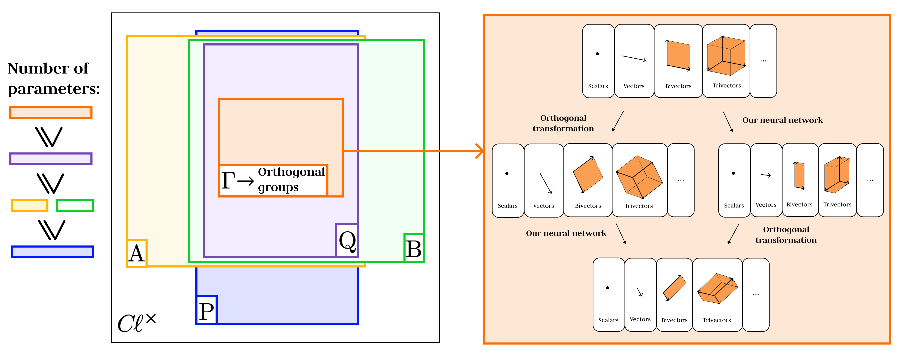

# Wider Groups, Fewer Weights: Efficient Pseudo-Orthogonal Equivariance via Geometric Algebras


## Abstract
We introduce a new parameter-efficient method for constructing pseudo-orthogonal-groups-equivariant neural networks based on geometric (Clifford) algebras. The approach is based on finding and considering larger groups than the Clifford groups in geometric algebras, which perform the same action as pseudo-orthogonal groups. By constructing networks equivariant to these larger groups, we automatically guarantee their equivariance to the corresponding pseudo-orthogonal group. This approach induces an expressiveness-efficiency trade-off: a larger equivariance group leads to stricter constraints on equivariant layers and thus fewer required optimizable parameters (weights). We propose and study specific groups for this framework, derive new equivariant mappings, and present several model configurations with varying levels of expressiveness and efficiency. Our models demonstrate strong performance on benchmark tasks including convex hull volume estimation, $N$-body dynamics prediction, and high-energy jet tagging.




## Overview
This repository contains implementation of general framework for geometric algebra-based layers:
* GA-linear layers,
* GA-geometric product layers,
* GA-normalization layers.
For each layer, there are modifications equivariant with respect to the groups $\mathrm{A}$, $\mathrm{B}$, $\mathrm{P}$, $\mathrm{Q}$, $\Gamma$  and the corresponding pseudo-orthogonal groups as well. The current implementation considers the case of the non-degenerate geometric algebras ${C \kern -0.1em \ell}(\mathbb{R}^{p,q})$. 


## Setup
- Install dependencies:
  ```bash
  pip install -r requirements.txt
  ```
- Recommended: launch experiments from the project root (`/home/kalexu97/Projects/glgenn`).

## Datasets
- Convex Hull (synthetic, generated locally):
  ```bash
  python data/generate_hull.py
  # writes to datasets/hulls/* (memmap .npy files consumed by loaders)
  ```
- O(6,0)-N-Body (pre-generated, included under `datasets/o6_nbody/`): ensure files are present at `datasets/o6_nbody/*.npy`.
- O(n,0) Regression (synthetic on-the-fly): no disk data required.
- Top Tagging (HDF5): place the dataset files under `datasets/top_tagging/*.h5` (train/val/test split file names must contain `train`, `val`, `test`).

## Running Experiments
All runs are logged under `lightning_logs/` with a structured run name. Key CLI flags (see `train.py` for full list):
- `--dataset {convex_hull,nbody,on_regression,top_tagging}`
- `--model {convex_hull_glgmlp,nbody_glgenn_gnn,on_glg,lorentz_cggnn}`
- `--dataroot` (required for `convex_hull`, `nbody`, `top_tagging`)
- `--n` (required for `convex_hull_glgmlp` and `on_glg`)
- `--num_samples`, `--batch_size`, `--max_steps`, `--val_n_interval`, `--seed`

Examples:
- Convex Hull (O(6,0)):
  ```bash
  python train.py \
    --dataset convex_hull --model convex_hull_glgmlp \
    --dataroot datasets --n 6 \
    --num_samples 1024 --batch_size 128 --max_steps 1024 \
    --subspace_type Q --val_n_interval 30 --seed 42
  ```
- N-Body (O(6,0)):
  ```bash
  python train.py \
    --dataset nbody --model nbody_glgenn_gnn \
    --dataroot datasets \
    --num_samples 3000 --batch_size 100 --max_steps 2000 \
    --nb_hidden_features 28 --nb_n_layers 3 \
    --subspace_type Q --val_n_interval 30 --seed 42
  ```
- O(n,0) Regression (e.g., n=8):
  ```bash
  python train.py \
    --dataset on_regression --model on_glg \
    --n 8 \
    --num_samples 30000 --batch_size 32 --max_steps 3001 \
    --on_output_qtgp 8 --on_hidden_mlp_1 580 --on_hidden_mlp_2 580 \
    --subspace_type Q --val_n_interval 30 --seed 42
  ```
- Top Tagging (Lorentz-CGGNN):
  ```bash
  python train.py \
    --dataset top_tagging --model lorentz_cggnn \
    --dataroot datasets \
    --batch_size 32 --max_steps 1000 \
    --num_workers 16 --scheduler cosine --subspace_type P \
    --tt_num_train 256 --tt_num_val 1024 --tt_num_test 1024 \
    --val_n_interval 30 --seed 42
  ```

Multi-run helper (Top Tagging):
```bash
bash scripts/top_tagging/P_TT_Nruns.sh 5 datasets
# Edits to the script control which experiments and repeat counts run.
```

Optional: view training with TensorBoard
```bash
tensorboard --logdir lightning_logs
```

## Analyze Results
Use the unified analyzer to aggregate metrics from TensorBoard or CSV logs and export a tidy CSV.

- Quick start (auto-detect TB/CSV):
  ```bash
  bash scripts/run_analysis.sh
  # writes src/experiments_summary.csv by default
  ```

- Full CLI (positional args):
  ```bash
  bash scripts/run_analysis.sh <output_csv> <source:auto|tb|csv> [include_regex] [dataset_filter] [model_filter]
  # example: only convex hull GLGMLP runs
  bash scripts/run_analysis.sh src/experiments_summary.csv auto "convex_hull_.*" convex_hull convex_hull_glgmlp
  ```

- Direct Python usage:
  ```bash
  python scripts/analyze_experiments.py \
    --log_dir lightning_logs \
    --output src/experiments_summary.csv \
    --source auto \
    --include_regex "on_regression.*on_glg" \
    --dataset on_regression \
    --model on_glg
  ```

The analyzer prints per-run summaries (e.g., final test/loss) and writes a long-form CSV with stats (mean/std/min/max) over full series and final values.

## Build Plots with the Notebook
The notebook `scripts/drow_plots.ipynb` reads `lightning_logs/` via the analyzer helpers and produces publication-ready plots.

1) Launch the notebook:
```bash
jupyter lab scripts/drow_plots.ipynb
# or: jupyter notebook scripts/drow_plots.ipynb
```
2) In the configuration cell, set:
- `LOG_DIR` (normally `project_root / 'lightning_logs'`)
- `MODEL_FILTER` (e.g., `convex_hull_glgmlp`, `nbody_glgenn_gnn`, `on_glg`, `lorentz_cggnn`)
- `METRICS_TO_PLOT` (e.g., `['test/loss']` or `['test/accuracy']`)
- Optional: `DATASET_FILTER` and `EXCLUDE_REGEX`

3) Run all cells. Figures are saved under `figures/` with DPI/format controlled in the notebook (`SAVE_DPI`, `SAVE_FORMAT`).

Tips:
- Use `include_regex`/`exclude` options to filter specific runs.
- If TensorBoard parsing is unavailable, set analyzer `source='csv'` and ensure Lightning CSV logs exist.